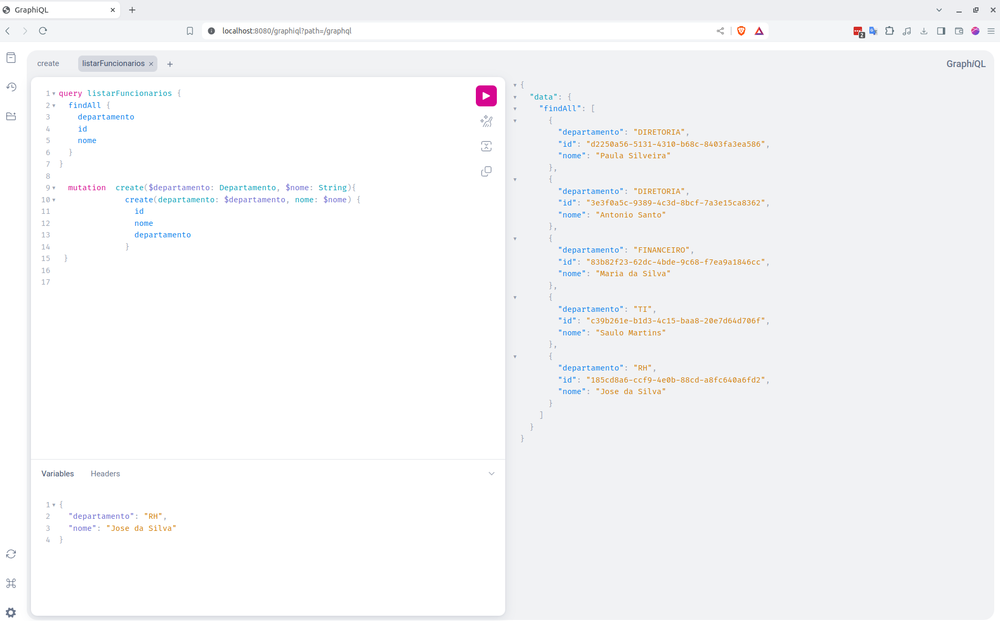

# Feltex-graphql





# Projeto de Gestão de Funcionários e Departamentos com GraphQL

## Descrição do Projeto
Este projeto é um sistema CRUD em memória desenvolvido em Java 21 e Spring Boot, utilizando GraphQL para gerenciar funcionários e departamentos. Ele permite criar, ler, atualizar e deletar dados de funcionários e departamentos, proporcionando uma interface eficiente e flexível para interagir com os dados.

## Funcionalidades
- **Criar Funcionário**: Adicionar um novo funcionário ao sistema.
- **Listar Funcionários**: Obter uma lista de todos os funcionários.
- **Atualizar Funcionário**: Atualizar as informações de um funcionário existente.
- **Deletar Funcionário**: Remover um funcionário do sistema.

## Tecnologias Utilizadas
- **Java 21**: Linguagem de programação utilizada para desenvolver a aplicação.
- **Spring Boot**: Framework utilizado para facilitar o desenvolvimento de aplicações Java.
- **GraphQL**: Linguagem de consulta para API, utilizada para interagir com os dados de forma eficiente.
- **HashMap**: Banco de dados em memória utilizado para armazenar os dados temporariamente.

## Pré-requisitos
- Java 21
- Maven 3.8.1 ou superior

## Como Executar o Projeto
1. **Clone o repositório**:
   ```sh
   git clone https://github.com/seu-usuario/seu-repositorio.git
   ```
2. **Navegue até o diretório do projeto**:
   ```sh
   cd seu-repositorio
   ```
3. **Compile o projeto utilizando Maven**:
   ```sh
   mvn clean install
   ```
4. **Execute a aplicação**:
   ```sh
   mvn spring-boot:run
   ```
   

A aplicação estará disponível em `http://localhost:8080`.

## Endpoints GraphQL
- **/graphql**: Endpoint principal para enviar queries e mutations.

## Exemplos de Queries e Mutations

### Consultar todos os funcionários
```graphql
query {
  funcionarios {
    id
    nome
    departamento
  }
}
```

### Adicionar um novo funcionário
```graphql
mutation createFuncionario($departamento: Departamento, $nome: String) {
    criar(departamento: $departamento, nome: $nome) {
        id
        nome
        departamento
    }
}
```

### Atualizar um funcionário existente
```graphql
mutation atualizar($id: ID, $nome: String, $departamento: Departamento) {
    atualizar(id: $id, nome: $nome, departamento: $departamento) {
        id
        nome
        departamento
    }
}
```

### Deletar um funcionário
```graphql
mutation delete($id: ID) {
    deletar(id: $id) {
        id
        nome
        departamento
    }
}
```


## Estrutura do Projeto
- **src/main/java**: Contém o código-fonte da aplicação.
    - **controller**: Controladores GraphQL.
    - **service**: Serviços que contêm a lógica de negócio.
    - **model**: Classes de modelo que representam os dados.
    - **repository**: Interfaces de repositório para acesso aos dados.
- **src/main/resources**: Contém arquivos de configuração e o schema GraphQL.

---

Este README oferece uma visão geral do projeto, suas funcionalidades e como configurá-lo e executá-lo. 
Sinta-se à vontade para personalizá-lo conforme necessário.